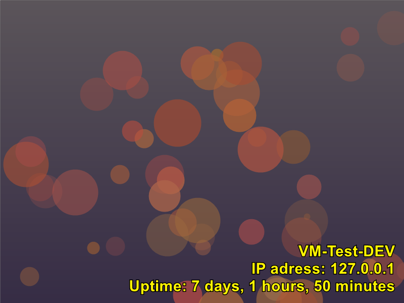

(Generated with PixelPoSH)

[](https://github.com/dabeastnet/PixelPoSH/actions/workflows/main.yml)

# PixelPoSH

PixelPoSH is a PowerShell module that generates customizable, random **SVG** backgrounds using the [PSSVG](https://github.com/StartAutomating/PSSVG) DSL (no System.Drawing). It includes patterns like bubbles, concentric circles, stripes, squares, two kinds of waves, and two types of lowpoly. You can add overlay text (single or multi-line), choose colours from palettes (local or colormind.io), and optionally rasterize to **PNG** using external tools. It's perfect for quickly generating backgrounds for desktops, websites, or any project that could use a splash of color and creativity. PixelPoSH also supports colored text!


Now works on **Windows, macOS, and Linux** with PowerShell 7+.!

## Example images
Please see the [EXAMPLES.md](./EXAMPLES.md) for sample output.

## Features

- Generate **SVG** at any size (crisp at any resolution).
- Multiple patterns: **Bubbles**, **Circles**, **Stripes**, **Squares**, **PaletteWave**, **GradientWave** (and optional **Low-Poly/Delaunay** if enabled).
- Overlay **text** with colour, size, multi-line support, and right-aligned anchoring.
- Optional **PNG** export via `rsvg-convert`, `magick` (ImageMagick), or `inkscape`.
- `colormind.io` API integration for fetching color palettes.

## Prerequisites

- **PowerShell 7+** (Core)
- **PSSVG** module
  ```powershell
  Install-Module PSSVG -Scope CurrentUser
  ```

* *(Optional for PNG and the ansible)* One of:

  * **librsvg** (`rsvg-convert`)
  * **ImageMagick** (`magick`)
  * **Inkscape** (`inkscape`)


## Installation

Clone the repo and import the module:

```powershell
git clone https://github.com/dabeastnet/PixelPoSH.git
Import-Module ./PixelPoSH/PixelPoSH.psm1
```

## Usage

`New-RandomImage` creates an SVG and saves it to a path. If you don’t specify a path, it defaults to your OS temp directory (e.g., `/tmp/Background.svg` or `%TEMP%\Background.svg`).

By default, a random pattern is chosen from:
`Bubble, Circle, Stripe, Square, PaletteWave, GradientWave, LowPolyGradient, LowPolyPalette` .
For each mode you define yourself, it will randomly select one of the modes.

## Examples

Below you can find some examples:

### Parameters
The following are the available parameters, with it's default values:
```powershell
        [int]$ImageWidth = 800,
        [int]$ImageHeight = 600,
        [string]$Path = ([System.IO.Path]::Combine([System.IO.Path]::GetTempPath(), 'Background.svg')),
        [string]$Text,
        [int]$TextSize = 40,
        [string]$TextColor = '#FFFFFF',
        [switch]$Bubble,
        [switch]$Circle,
        [switch]$Square,
        [switch]$Stripe,
        [switch]$PaletteWave,
        [switch]$GradientWave,
        [switch]$LowPolyGradient,
        [switch]$LowPolyPalette,
        [string]$PngPath, #Patch to save the PNG to
        [switch]$RasterizeToPng, #Switch to rasterize
        [string]$PngBackground = 'none'   # or '#ffffff' if you want opaque PNGs by default
```
> Tip: Multi-line text works using backtick-n: `` `n `` (see example below).

### Quick examples

**Default 800×600 SVG** (random pattern)

This command creates an 800x600 svg with a randomly selected pattern and saves it to `C:\temp` or `/tmp/`.

```powershell
New-RandomImage
```

**1920×1080 SVG with Squares and custom text**

```powershell
New-RandomImage -ImageWidth 1920 -ImageHeight 1080 `
  -Square -Text 'Sample Text' `
  -Path "$HOME/Pictures/square-bg.svg"
```

**Allow either Bubble or Square (randomly picked)**

```powershell
New-RandomImage -Bubble -Square
```

**Multi-line, coloured text**
```powershell
New-RandomImage -Text "LOLOLOL`nPixelPoSH is 9001`nLOLOLOL" -TextSize 60 -TextColor "#AAFFFF"
# The (backtic) `n is used as a newline indicator
```


**SVG + PNG**

```powershell
New-RandomImage -GradientWave `
  -Path "$HOME/Pictures/bg.svg" `
  -PngPath "$HOME/Pictures/bg.png"
```

### Color palettes

By default, the module tries to fetch a random palette from **colormind.io**. If offline/unavailable, it uses a built-in set of 100 palettes.

To refresh the embedded palettes, run `Get-StaticPalettes.ps1`. It writes a Base64 JSON to a file; copy the contents into the `Get-ColorPalette` subfunction’s `$B64Palettes` string in `PixelPoSH.psm1`.

```powershell
function Get-ColorPalette {
    # ...
    #region B64
    $B64Palettes = "[BASE 64 ENCODED PALETTES GO HERE]"
    #endregion B64
    # ...
}
```
> Encoding tip: JSON is typically UTF-8. Decode with `[Text.Encoding]::UTF8.GetString([Convert]::FromBase64String(...))`.

### Advanced example
Here is an example to display machinename, IP and uptime on the image (Windows example).
```powershell
#Fetch the info
$IP = (Get-NetIPConfiguration | Where-Object { $_.IPv4DefaultGateway -ne $null -and $_.NetAdapter.Status -eq 'Up' }).IPv4Address.IPAddress
$Uptime = (get-date) - (gcim Win32_OperatingSystem).LastBootUpTime
$FormattedUptime = "{0} days, {1} hours, {2} minutes" -f $Uptime.Days, $Uptime.Hours, $Uptime.Minutes, $Uptime.Seconds

#Generate the image in a yellow text
New-RandomImage -Text "$env:COMPUTERNAME`nIP Address: $IP`nUptime: $FormattedUptime" -TextSize 30 -TextColor "#FFF500"
```



# PNG export (optional)

If you enable PNG export in the module, it will try tools in this order: `rsvg-convert` → `magick` → `inkscape`.

Install one of:

* Ubuntu: `sudo apt update && sudo apt install librsvg2-bin`
* macOS (Homebrew): `brew install librsvg` *(or `brew install imagemagick`)*
* Windows (winget): `winget install ImageMagick.ImageMagick` *(Q16 build with SVG support)*

# Docker usage

A prebuilt image is published to Docker Hub as `[hub.docker.com/r/dabeastnet/pixelposh](https://hub.docker.com/r/dabeastnet/pixelposh)`. It includes PowerShell 7, PSSVG, and librsvg (`rsvg-convert`) so you can generate **SVG** and **PNG** without installing anything locally.

## Pull

```bash
docker pull dabeastnet/pixelposh:latest
# (Optional) always fetch the newest tag:
docker run --pull=always dabeastnet/pixelposh:latest pwsh -c '$PSVersionTable.PSVersion'
```

## Generate an SVG

```bash
mkdir -p out
docker run --rm -v "$PWD/out:/out" dabeastnet/pixelposh:latest \
  pwsh -NoProfile -c "
    Import-Module ./PixelPoSH/PixelPoSH.psm1;
    New-RandomImage -GradientWave -Text 'Hello Docker' -Path /out/bg.svg
  "
```

## Generate a PNG (rasterized from SVG inside the container)

```bash
docker run --rm -v "$PWD/out:/out" dabeastnet/pixelposh:latest \
  pwsh -NoProfile -c "
    Import-Module ./PixelPoSH/PixelPoSH.psm1;
    New-RandomImage -PaletteWave -Text 'Hello PNG' -Path /out/bg.svg -RasterizeToPng -PngPath /out/bg.png
  "
```

### Notes

* The module inside the image lives at `./PixelPoSH/PixelPoSH.psm1` (already on `$PSModulePath` when you `Import-Module` with a relative path as shown).
* Default font stack is `Arial, Helvetica, DejaVu Sans, sans-serif`. You can mount your own fonts if you need a specific face.
* Prefer `:latest` (with `--pull=always`) for convenience, or pin a specific tag/digest for reproducibility.

# Ansible usage

An opinionated playbook is provided under **`/ansible`** to:

1. (Best effort) read the target’s resolution
2. Generate a random **PNG** on the **controller** using PixelPoSH
3. Copy it to each target
4. Set it as the desktop background (Windows / GNOME / XFCE)

## Layout (repo)

```
/ansible
├─ inventory                 # your hosts (ini or yaml)
├─ files/
│  └─ PixelPoSH.psm1         # the module the controller imports
└─ pixelposh_wallpaper_playbook.yml
```

> Make sure `ansible/files/PixelPoSH.psm1` matches the version you want to use.
> The playbook imports it directly from that path on the **controller**.


## Run it

From the repo root (or adjust paths accordingly):

```bash
ansible-playbook -i ansible/inventory.yml ansible/pixelposh_wallpaper_playbook.yml
```

### If Linux targets require sudo

Provide a sudo password (only needed for the wallpaper-apply step when you’re not connecting as the desktop user):

```bash
ansible-playbook -i ansible/inventory.yml ansible/pixelposh_wallpaper_playbook.yml -K
```

…or set in `group_vars` (recommend encrypting with Ansible Vault):

```yaml
# ansible/group_vars/linux.yml
ansible_become: yes
ansible_become_method: sudo
ansible_become_password: YOUR_SUDO_PASS
```

## What the playbook does (quick reference)

* **Generates** the image on the controller in `ansible/files/_out/<hostname>.png`
* **Copies** it to the target:

  * Windows → `C:\Windows\Web\Wallpaper\pixelposh.png`
  * Linux → `/tmp/pixelposh_<hostname>.png`
* **Sets** the wallpaper:

  * **Windows**: Win32 `SystemParametersInfo(SPI_SETDESKWALLPAPER)` via PowerShell
  * **GNOME**: `gsettings set org.gnome.desktop.background picture-uri{,-dark} file:///…` (runs as the desktop user; uses the user’s DBus session)
  * **XFCE**: `xfconf-query` updates all `last-image` keys

## Troubleshooting tips

* **GNOME didn’t change**: ensure a desktop session is active for the target user and that `/run/user/<uid>/bus` exists. If you SSH as another user, the playbook must `become_user: <desktopuser>` for the gsettings step.
* **Windows didn’t change**: confirm WinRM is configured and the account has rights to update HKCU; a reboot/logoff isn’t required, but Explorer sometimes caches—lock/unlock the session if needed.
* **PNG generation failed**: the controller needs PowerShell 7 and the module at `ansible/files/PixelPoSH.psm1`. The playbook uses `rsvg-convert`/ImageMagick only if you enable PNG rasterization in your module; our script path uses the built-in rasterization helper.


## Contributing

Contributions to PixelPoSH are welcome! Please feel free to submit pull requests or create issues for bugs and feature suggestions on our [GitHub repository](https://github.com/dabeastnet).


## License

This project is licensed under the GNU General Public License v3.0 - see the `COPYING` file for more details.
