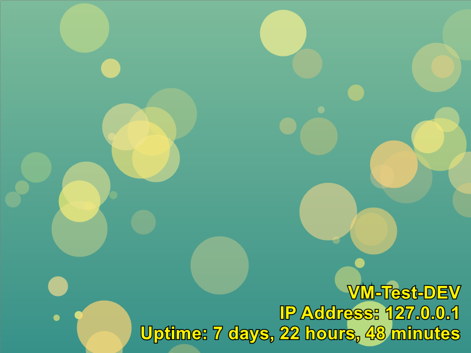

(Generated with PixelPoSH)

# PixelPoSH

PixelPoSH is a PowerShell module that generates customizable, random backgrounds using System.Drawing in .NET. This tool allows users to create images with various graphical patterns like bubbles, concentric circles, stripes, squares and 2 typed of waves. It's perfect for quickly generating backgrounds for desktops, websites, or any project that could use a splash of color and creativity. PixelPoSH also supports colored text!

## Features

- Generate images with specified width and height.
- Choose between multiple patterns: bubbles, concentric circles, stripes, squares and 2 types of waves.
- Add optional text to the image: this can be colored and you can specify textsize.
- Save images to a specified path in PNG format.
- `colormind.io` API integration for fetching color palettes.

## Prerequisites

Before you use PixelPoSH, make sure to have PowerShell and the System.Drawing assembly loaded on your machine. This module is built on .NET and requires proper setup to function.

## Installation

Download the PixelPoSH script or clone this repository to your local machine:

```powershell
git clone https://github.com/dabeastnet/PixelPoSH.git
```

Import the module into your PowerShell session:

```powershell
Import-Module ./path/to/PixelPoSH.psm1
```

## Usage

To generate an image, you can use the `New-RandomImage` function with its parameters. By default, the script randomly selects one of the 4 modes: `Bubble, Circle, Stripe, Square, PaletteWave and GradientWave`. For each mode you define yourself, it will randomly select one of the modes.

### Color Palettes

The script uses the `colormind.io` API to fetch a random color palette. If the API is not available (for example for offline use), It will select one of the 100 included color palettes.

If you wish to update these palettes, simply run `Get-StaticPalettes.ps1`. This will generate a textfile at `c:\temp\B64 encoded palette.txt`. Use the contents of this file to update the B64 string in the `PixelPoSH.psm1` file in the `Get-ColorPalette` subfunction.:

```powershell
    function Get-ColorPalette {
...
    
        #Static list of 100 palettes
        #region B64
        $B64Palettes = "[BASE 64 ENCODED PALETTES GO HERE]" 
        #endregion B64
...
    
    }#Get-ColorPalette

```


## Examples

Below you can find some examples:

## Example images
Please see the [EXAMPLES.md](./EXAMPLES.md) for some example output.

### Parameters
The following are the available parameters, with it's default values:
```powershell
        [int]$ImageWidth = 800,
        [int]$ImageHeight = 600,
        [string]$Path = "C:\temp\Background.png",
        [string]$Text = $null,
        [int]$TextSize = 40,                     
        [String]$TextColor = "#FFFFFF",  
        [switch]$Bubble,
        [switch]$Circle,
        [switch]$Stripe,
        [switch]$PaletteWave,
        [switch]$GradientWave,
        [switch]$Square
```

### Generate an image with default settings

This command creates an 800x600 image with a randomly selected pattern and saves it to `C:\temp\Background.png`.

```powershell
New-RandomImage
```

### Create a 1920x1080 image with a square pattern and custom text

```powershell
New-RandomImage -ImageWidth 1920 -ImageHeight 1080 -Path "C:\temp\test.png" -Text "Sample Text" -Square
```

### Generate an image with a bubble or square pattern

```powershell
New-RandomImage -Bubble -Square
```

### Create a 800x600 image with a multiline, colored custom text in size 60
```powershell
New-RandomImage -Text "LOLOLOL`nPixelPoSH is 9001`nLOLOLOL" -TextSize 60 -TextColor "#AAFFFF"
# The (backtic) `n is used as a newline indicator
```


### Advanced text
Here is an example to display machinename, IP and uptime on the image.
```powershell
#Fetch the info
$IP = (Get-NetIPConfiguration | Where-Object { $_.IPv4DefaultGateway -ne $null -and $_.NetAdapter.Status -eq 'Up' }).IPv4Address.IPAddress
$Uptime = (get-date) - (gcim Win32_OperatingSystem).LastBootUpTime
$FormattedUptime = "{0} days, {1} hours, {2} minutes" -f $Uptime.Days, $Uptime.Hours, $Uptime.Minutes, $Uptime.Seconds

#Generate the image in a yellow text
New-RandomImage -Text "$env:COMPUTERNAME`nIP Address: $IP`nUptime: $FormattedUptime" -TextSize 30 -TextColor "#FFF500"
```



## Contributing

Contributions to PixelPoSH are welcome! Please feel free to submit pull requests or create issues for bugs and feature suggestions on our [GitHub repository](https://github.com/dabeastnet).


## License

This project is licensed under the GNU General Public License v3.0 - see the `COPYING` file for more details.